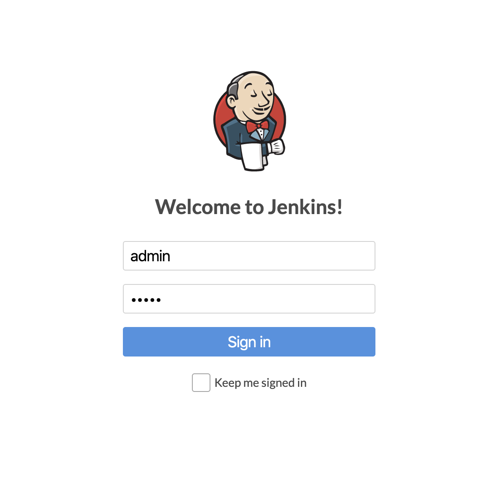
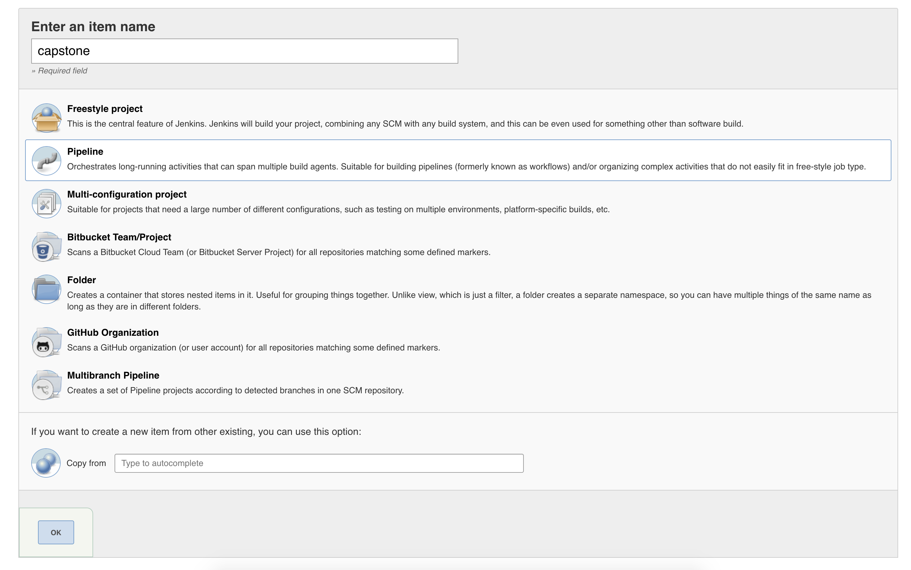
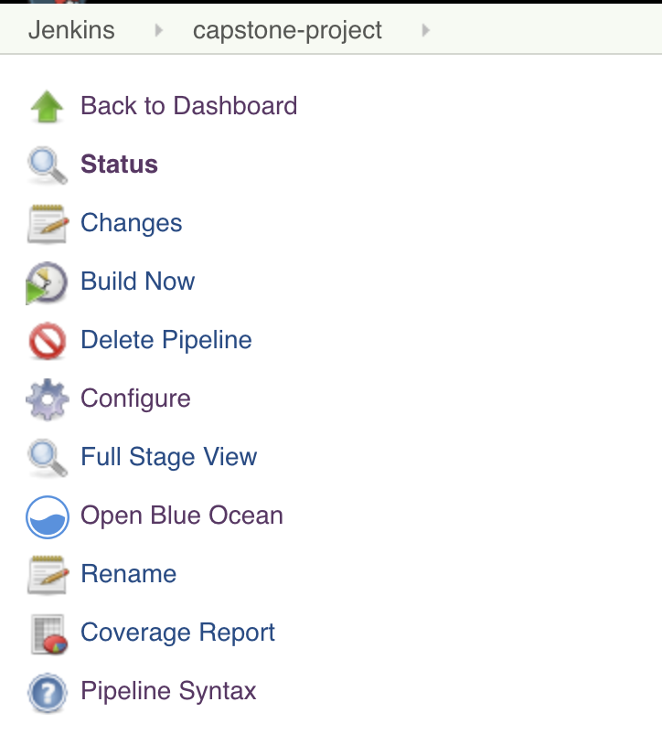
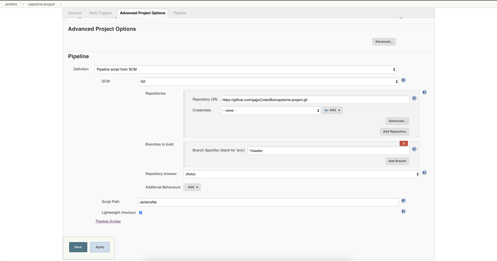
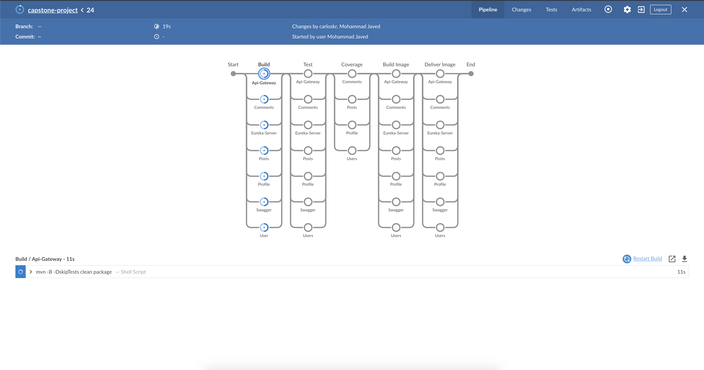
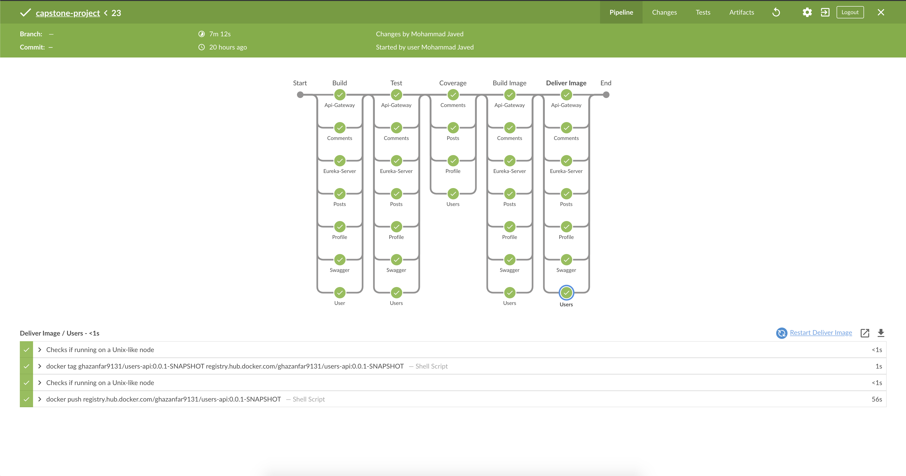
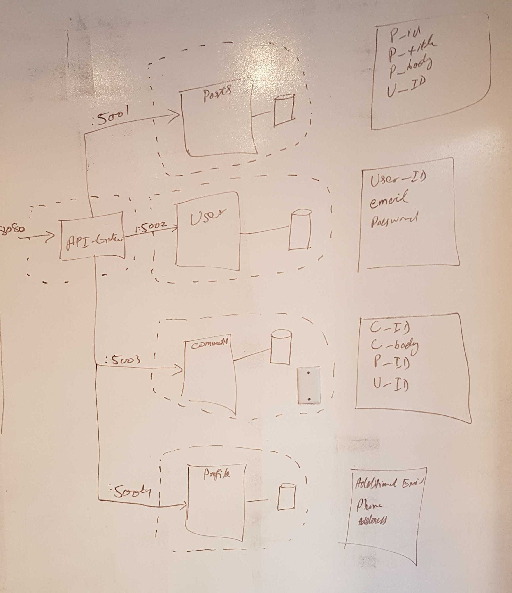
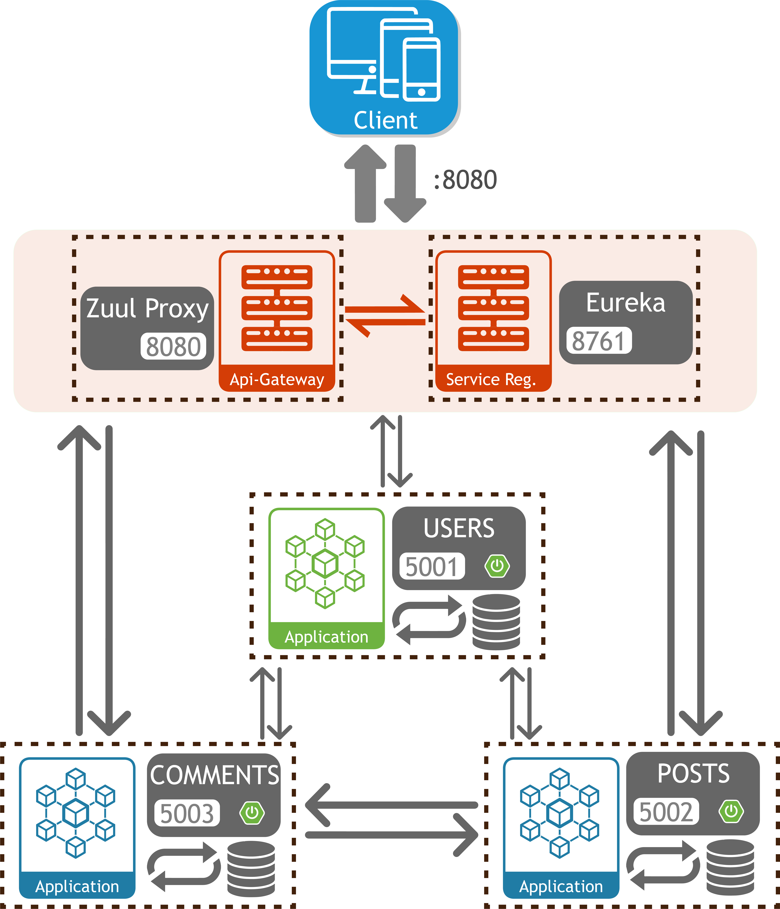

# Capstone-Project

<p align="center">
  <a href="#">
    
  </a>
</p>

<h3 align="center">Scandit (Back-End Micro-services REST API)</h3>

<p align="center">
  Foodie is an a discussion forum where people post and comment on a food recipe. 
  <br>
    
  <br>
  ·
  <a href="https://www.pivotaltracker.com/n/projects/2416993">User Stories</a>
   ·
</p>

## Table of contents

- [User Stories](#user-stories)
- [Timeline](#timeline)
- [Architecture](#architecture)
- [Installation Instruction](#installation-instruction)
- [Jenkins Instruction](#jenkins-instruction)
- [API](#api)
- [What's Included](#whats-included)
- [Creators](#developers)


## User Stories

[Pivotal Tracker (Back-End REST API)](https://www.pivotaltracker.com/n/projects/2416993)

Application Goals from User Stories are:
    
* Sign-up and Create Scandit User
* Anyone can See Posts and Comments
* Signed-in user able to post a Post and comment
* Signed-in user able to delete it's own Posts and Comments

## Technology Used

   - Spring boot is used for the backend Services.
   - Zuul Eureka client is used for load-balancing between Services.
   - Zuul Gateway for Api-Gateway to forward api requests to Services. 
   - Postgres is Used for the database. 
   - Docker to run the services. 
   - Swagger to Create API Documentation.
   - Jenkins for CI/CD
   - Pivotal Cloud Foundry is used to deploy the application.
   
## General Approach

We discussed the architecture of the project and decided to use a database for each component. We figured out
how to proceed with the development and created the corresponding user stories that will lead us to completion.

We used pair programming and collaborated with each other and tried to stick to our schedule.

## Major Hurdles

   - Adding the different services to the Jenkins pipeline and getting the coverage to show
   - Getting the services to communicate through the queues


## Installation Instruction

Follow these easy step:
    

   1. Clone the repository:
        ```
        https://github.com/gajjuCoderBoi/capstone-project.git
        ```
   2. Execute this on command line:

        ```
        $cd capstone-project
        $docker-compose up
        ```
      * if don't have Docker install from [here](https://docs.docker.com/v17.09/engine/installation/)
   3. Enjoy
   
## Docs

https://gajjucoderboi.github.io/capstone-project/

## Jenkins Instruction
Follow these easy step:
   

  1. Run Jenkins by using following command:
       ```
       https://github.com/gajjuCoderBoi/capstone-project.git
       ```
      * if don't have Jenkins install from [here](https://jenkins.io/doc/book/installing/)
  
  2. Run Jenkins:
   
       ```
       $jenkins-lts
       ```
  3. Login
    
     
     
  4. New Item.
  
     Click New Item on Left panel.
   
  5. Create Pipeline
 
     
     
  6. Open Created Item and Configure. 
  
     
     
     
     
  7. Open BlueOcean in Jenkins and Run Project. 
    
      
        * if you don't have blueocean plugin install from [here](https://plugins.jenkins.io/blueocean)
  
  8. Successful Jenkins Pipeline. 
  
         
   

## Timeline

1. Requirement Analysis
    * Thursday(Nov 21, 2019) - user stories
        
        We give our user stories points, so that we could prioritize our development steps. 
 
            https://www.pivotaltracker.com/n/projects/2416993
            
        For messaging services, we decided we would use RabbitMQ for microservices communication.
       
        A new repository was created.
    
    * Friday(Nov 22, 2019) - Research
        
        We research how the actual implementation of the communication services using RabbitMQ should look.
            
         [Architecture](#architecture)
         
    * Saturday  (Nov 23, 2019) - Replaced RestTemplate communication points with RabbitMQ.
    
            Added queues for microservices communication
            
    * Monday(Nov 26, 2019) - Microservices communication finish and testing. Started Input Validation @ back-end
    
            Continued to work on microservices communication. Finished routes and testing,
            
            Added input validation at the back-end. 
        
    * Tuesday(Nov 27, 2019) - Finished back-end validation started Exception Handling.
    
            Finished input validation at the back-end
            
            Started adding Exception Handling
            
    * Wednesday (Nov 28, 2019) - Start working on Swagger and JUnit testing
            Started working on Swagger
            Started writing the tests
            
    * Thanksgiving weekend (Nov 29 - Dec 1) - Continued working with Swagger, JUnit Test and started working on Jenkins
      pipeline
           Swagger work continued
           Testing work continued
           
    * Monday (Dec 2, 2019) - Swagger was completed. JUnit Test was completed and Jenkins was set up. Work on logging started,
                     
           Testing was completed
           Swagger was implemented
           Work on logging started
     
    * Tuesday (Dec 3, 2019) - Logging work continued. Integration testing started
           Logging completed
           JavaDocs created
           Integration Test started
         
    
            *-*-*-*-*-*-*
        
      

  

## Architecture
##### Rough Sketch of Architecture Diagram.


##### Soft Representation of Architecture Diagram.

    
    
     

## API
```text
Base URL: /, Version: 1.1

Default request content-types: application/json

Default response content-types: application/json

Schemes: http 
```
Documentation for the API can be found in the [swagger](./swagger) files and [API Reference](#api-reference). There are a lot of tools available to automatically generate client from Swagger format. For more information about Swagger see official website - http://swagger.io/.


## API Reference

<table style="
    width: 100%;
    max-width: 100%;
    margin-bottom: 20px;
    border: 1px solid #ddd;
    border-collapse: collapse;
    border-spacing: 0;
    background-color: transparent;
    display: table;
">
    <thead>
    <tr>
        <th>Path</th>
        <th>Operation</th>
        <th>Description</th>
        <th>Microservice->Controller#Method</th>
    </tr>
    </thead>
    <tbody>
    <tr>
        <td style="border: 1px solid #ddd;padding: 5px;" rowspan="2" style="border: 1px solid #ddd;padding: 5px;">
            <a href="#summary">/users/signup</a>
        </td>
    </tr>
    <tr>
        <td style="border: 1px solid #ddd;padding: 5px;">
            <a href="#post-usersignup">POST</a>
        </td>
        <td style="border: 1px solid #ddd;padding: 5px;">
            <p>Create a User (Sign-up)</p>
        </td>
        <td style="border: 1px solid #ddd;padding: 5px;">
            <p>Users-api->UserController#signup</p>
        </td>
    </tr>
    <tr>
        <td style="border: 1px solid #ddd;padding: 5px;" rowspan="2" style="border: 1px solid #ddd;padding: 5px;">
            <a href="#summary">/users/login</a>
        </td>
    </tr>
    <tr>
        <td style="border: 1px solid #ddd;padding: 5px;">
            <a href="#post-userlogin">POST</a>
        </td>
        <td style="border: 1px solid #ddd;padding: 5px;">
            <p>Create a login session.</p>
        </td>
        <td style="border: 1px solid #ddd;padding: 5px;">
            <p>Users-api->UserController#login</p>
        </td>
    </tr>
    <tr>
        <td style="border: 1px solid #ddd;padding: 5px;" rowspan="3">
            <a href="#summary">/profiles/</a>
        </td>
        <td style="border: 1px solid #ddd;padding: 5px;">
            <a href="#get-profile">GET</a>
        </td>
        <td style="border: 1px solid #ddd;padding: 5px;">
            <p>Retrieve the profile of the User. (Auth Token Required)</p>
        </td>
        <td style="border: 1px solid #ddd;padding: 5px;">
            <p>Profile-API->ProfileController#getProfile</p>
        </td>
    </tr>
    <tr>
        <td style="border: 1px solid #ddd;padding: 5px;">
            <a href="#post-profile">POST</a>
        </td>
        <td style="border: 1px solid #ddd;padding: 5px;">
            <p>Create the profile of the User. (Auth Token Required)</p>
        </td>
        <td style="border: 1px solid #ddd;padding: 5px;"ProfileController#>
            <p>Profile-API->ProfileController#createProfile</p>
        </td>
    </tr>
    <tr>
        <td style="border: 1px solid #ddd;padding: 5px;">
            <a href="#put-profile">PUT</a>
        </td>
        <td style="border: 1px solid #ddd;padding: 5px;">
            <p>Update profile of the User. (Auth Token Required)</p>
        </td>
        <td style="border: 1px solid #ddd;padding: 5px;">
            <p>Profile-API->ProfileController#updateProfile</p>
        </td>
    </tr>
    <tr>
        <td style="border: 1px solid #ddd;padding: 5px;" rowspan="2">
            <a href="#summary">/posts/</a>
        </td>
    </tr>
    <tr>
        <td style="border: 1px solid #ddd;padding: 5px;">
            <a href="#post-post">POST</a>
        </td>
        <td style="border: 1px solid #ddd;padding: 5px;">
            <p>Create a Posts of the User (Auth Token Required).</p>
        </td>
        <td style="border: 1px solid #ddd;padding: 5px;">
            <p>Posts-API->PostController#addPost</p>
        </td>
    </tr>
    <tr>
        <td style="border: 1px solid #ddd;padding: 5px;" rowspan="2" style="border: 1px solid #ddd;padding: 5px;">
            <a href="#summary">/posts/list</a>
        </td>
    </tr>
    <tr>
        <td style="border: 1px solid #ddd;padding: 5px;">
            <a href="#get-postlist">GET</a>
        </td>
        <td style="border: 1px solid #ddd;padding: 5px;">
            <p>Retrieve all the posts.</p>
        </td>
        <td style="border: 1px solid #ddd;padding: 5px;">
            <p>Posts-API->PostController#listPost</p>
        </td>
    </tr>
    <tr>
        <td style="border: 1px solid #ddd;padding: 5px;" rowspan="2">
            <a href="#">/posts/{postId}</a>
        </td>
    </tr>
    <tr>
        <td style="border: 1px solid #ddd;padding: 5px;">
            <a href="#delete-postid">DELETE</a>
        </td>
        <td style="border: 1px solid #ddd;padding: 5px;">
            <p>Deleting a Post. (Auth Token Required).</p>
        </td>
        <td style="border: 1px solid #ddd;padding: 5px;">
            <p>Posts-API->PostController#deletePost</p>
        </td>
    </tr>
    <tr>
        <td style="border: 1px solid #ddd;padding: 5px;" rowspan="2">
            <a href="#">/comments/{postId}</a>
        </td>
        <td style="border: 1px solid #ddd;padding: 5px;">
            <a href="#post-commentpostid">GET</a>
        </td>
        <td style="border: 1px solid #ddd;padding: 5px;">
            <p>Get Comments of a Post by postId. </p>
        </td>
        <td style="border: 1px solid #ddd;padding: 5px;">
            <p>CommentController#getCommentsByPostId</p>
        </td>
        <td style="border: 1px solid #ddd;padding: 5px;">
            <a href="#post-commentpostid">POST</a>
        </td>
        <td style="border: 1px solid #ddd;padding: 5px;">
            <p>Creating a comment on a post. (Auth Token Required). </p>
        </td>
        <td style="border: 1px solid #ddd;padding: 5px;">
            <p>CommentController#createComment</p>
        </td>
    </tr>
    <tr>
        <td style="border: 1px solid #ddd;padding: 5px;" rowspan="2">
            <a href="#summary">/comments/{commentId}</a>
        </td>
        <td style="border: 1px solid #ddd;padding: 5px;">
            <a href="#put-commentcommentid">PUT</a>
        </td>
        <td style="border: 1px solid #ddd;padding: 5px;">
            <p>Updating a comment. (Auth Token Required).</p>
        </td>
        <td style="border: 1px solid #ddd;padding: 5px;">
            <p>Posts-API->PostController#updateComment</p>
        </td>
    </tr>
    <tr>
        <td style="border: 1px solid #ddd;padding: 5px;">
            <a href="#delete-commentcommentid">DELETE</a>
        </td>
        <td style="border: 1px solid #ddd;padding: 5px;">
            <p>Deleting a Comment. (Auth Token Required).</p>
        </td>
        <td style="border: 1px solid #ddd;padding: 5px;">
            <p>Posts-API->PostController#deleteComment</p>
        </td>
    </tr>
    </tbody>
</table>

## What's included

Within the download you'll find the following directories and files, logically grouping common assets and providing both compiled and minified variations. You'll see something like this:

```text
capstone-project/
.
├── API-Gateway
│   ├── Dockerfile
│   ├── api-gateway.iml
│   ├── manifest.yml
│   ├── mvnw
│   ├── mvnw.cmd
│   ├── pom.xml
│   └── src
│       ├── main
│       │   ├── java
│       │   │   └── com
│       │   │       └── example
│       │   │           └── APIGateway
│       │   │               ├── TestController.java
│       │   │               └── ZuulGatewayApplication.java
│       │   └── resources
│       │       ├── application-dev.properties
│       │       ├── application-pcf.properties
│       │       └── application.properties
│       └── test
│           └── java
│               └── com
│                   └── example
│                       └── APIGateway
│                           └── ZuulGatewayApplicationTests.java
├── Jenkinsfile
├── Jenkinsfile_api-gateway
├── Jenkinsfile_comments-api
├── Jenkinsfile_eureka-server
├── Jenkinsfile_posts-api
├── Jenkinsfile_profile-api
├── Jenkinsfile_swagger-app
├── Jenkinsfile_users-api
├── README.md
├── comments-api
│   ├── Dockerfile
│   ├── manifest.yml
│   └── src
│       ├── main
│       │   ├── java
│       │   │   └── com
│       │   │       └── ga
│       │   │           └── commentsapi
│       │   │               ├── CommentsApplication.java
│       │   │               ├── bean
│       │   │               │   ├── Post.java
│       │   │               │   └── User.java
│       │   │               ├── config
│       │   │               │   ├── DatabaseLoader.java
│       │   │               │   ├── RabbitMQConfig.java
│       │   │               │   ├── SwaggerDocumentationConfiguration.java
│       │   │               │   └── WebSecurityConfig.java
│       │   │               ├── controller
│       │   │               │   └── CommentController.java
│       │   │               ├── exception
│       │   │               │   ├── CommentNotExistException.java
│       │   │               │   ├── ErrorResponse.java
│       │   │               │   ├── MyExceptionHandler.java
│       │   │               │   ├── PostNotExistException.java
│       │   │               │   ├── TokenException.java
│       │   │               │   └── UnauthorizeActionException.java
│       │   │               ├── messagequeue
│       │   │               │   ├── Receiver.java
│       │   │               │   └── Sender.java
│       │   │               ├── model
│       │   │               │   └── Comment.java
│       │   │               ├── repository
│       │   │               │   └── CommentRepository.java
│       │   │               └── service
│       │   │                   ├── CommentService.java
│       │   │                   └── CommentServiceImpl.java
│       │   └── resources
│       │       ├── application-dev.properties
│       │       ├── application-local.properties
│       │       ├── application-pcf.properties
│       │       └── application.properties
│       └── test
│           └── java
│               └── com
│                   └── ga
│                       └── commentsapi
│                           ├── CommentsApplicationTests.java
│                           ├── controller
│                           │   └── CommentControllerTest.java
│                           ├── exception
│                           │   └── MyExceptionHandlerTest.java
│                           └── service
│                               └── CommentsServiceTest.java
├── deployment.sh
├── docker-compose.yml
├── eureka-server
│   ├── Dockerfile
│   ├── README.md
│   ├── eureka-server.iml
│   ├── manifest.yml
│   ├── mvnw
│   ├── mvnw.cmd
│   ├── pom.xml
│   └── src
│       ├── main
│       │   ├── java
│       │   │   └── com
│       │   │       └── example
│       │   │           └── eurekaserver
│       │   │               └── EurekaServerApplication.java
│       │   └── resources
│       │       ├── application-dev.properties
│       │       ├── application-pcf.properties
│       │       └── application.properties
│       └── test
│           └── java
│               └── com
│                   └── example
│                       └── eurekaserver
│                           └── EurekaServerApplicationTests.java
├── logstash.conf
├── manifest.yml
├── posts-api
│   ├── Dockerfile
│   ├── manifest.yml
│   └── src
│       ├── main
│       │   ├── java
│       │   │   └── com
│       │   │       └── ga
│       │   │           └── postsapi
│       │   │               ├── PostsApiApplication.java
│       │   │               ├── bean
│       │   │               │   ├── Comment.java
│       │   │               │   ├── PostRequestBody.java
│       │   │               │   └── User.java
│       │   │               ├── cofig
│       │   │               │   ├── DatabaseLoader.java
│       │   │               │   ├── RabbitMQConfig.java
│       │   │               │   ├── SwaggerDocumentationConfiguration.java
│       │   │               │   └── WebSecurityConfig.java
│       │   │               ├── controller
│       │   │               │   └── PostController.java
│       │   │               ├── exception
│       │   │               │   ├── ErrorResponse.java
│       │   │               │   ├── MyExceptionHandler.java
│       │   │               │   ├── PostNotExistException.java
│       │   │               │   ├── TokenException.java
│       │   │               │   └── UnauthorizeActionException.java
│       │   │               ├── messagequeue
│       │   │               │   ├── Receiver.java
│       │   │               │   └── Sender.java
│       │   │               ├── model
│       │   │               │   └── Post.java
│       │   │               ├── repository
│       │   │               │   └── PostRepository.java
│       │   │               └── service
│       │   │                   ├── PostService.java
│       │   │                   └── PostServiceImpl.java
│       │   └── resources
│       │       ├── application-dev.properties
│       │       ├── application-local.properties
│       │       ├── application-pcf.properties
│       │       └── application.properties
│       └── test
│           └── java
│               └── com
│                   └── ga
│                       └── postsapi
│                           ├── controller
│                           │   └── PostControllerTest.java
│                           ├── exception
│                           │   └── MyExceptionHandlerTest.java
│                           └── service
│                               └── PostServiceTest.java
├── profile-api
│   ├── Dockerfile
│   └── src
│       ├── main
│       │   ├── java
│       │   │   └── com
│       │   │       └── ga
│       │   │           └── profileapi
│       │   │               ├── ProfileAPIApplication.java
│       │   │               ├── bean
│       │   │               │   └── User.java
│       │   │               ├── config
│       │   │               │   ├── RabbitMQConfig.java
│       │   │               │   ├── SwaggerDocumentationConfiguration.java
│       │   │               │   └── WebSecurityConfig.java
│       │   │               ├── controller
│       │   │               │   └── UserProfileController.java
│       │   │               ├── exception
│       │   │               │   ├── EntityNotCreatedException.java
│       │   │               │   ├── EntityNotFoundException.java
│       │   │               │   ├── ErrorResponse.java
│       │   │               │   ├── MyExceptionHandler.java
│       │   │               │   ├── ProfileNotFoundException.java
│       │   │               │   └── TokenException.java
│       │   │               ├── messagequeue
│       │   │               │   └── Sender.java
│       │   │               ├── model
│       │   │               │   └── Profile.java
│       │   │               ├── repository
│       │   │               │   └── ProfileRepository.java
│       │   │               └── service
│       │   │                   ├── ProfileService.java
│       │   │                   └── ProfileServiceImpl.java
│       │   └── resources
│       │       ├── application-dev.properties
│       │       ├── application-local.properties
│       │       ├── application-pcf.properties
│       │       └── application.properties
│       └── test
│           └── java
│               └── com
│                   └── ga
│                       └── profileapi
│                           ├── ProfileAPIApplicationTests.java
│                           ├── controller
│                           │   └── UserProfileControllerTest.java
│                           ├── exception
│                           │   └── MyExceptionHandlerTest.java
│                           └── service
│                               └── ProfileServiceTest.java
├── swagger
│   ├── comments-api.json
│   ├── posts-api.json
│   ├── profile-api.json
│   ├── swagger.iml
│   └── users-api.json
├── swagger-app
│   ├── Dockerfile
│   ├── HELP.md
│   ├── manifest.yml
│   ├── mvnw
│   ├── mvnw.cmd
│   ├── pom.xml
│   ├── src
│   │   ├── main
│   │   │   ├── java
│   │   │   │   └── com
│   │   │   │       └── ga
│   │   │   │           └── swaggerapp
│   │   │   │               ├── SwaggerAppApplication.java
│   │   │   │               ├── config
│   │   │   │               │   ├── ServiceDefinitionsContext.java
│   │   │   │               │   ├── ServiceDescriptionUpdater.java
│   │   │   │               │   └── SwaggerUIConfiguration.java
│   │   │   │               └── controller
│   │   │   │                   └── ServiceDefinitionController.java
│   │   │   └── resources
│   │   │       ├── application-dev.properties
│   │   │       ├── application-local.properties
│   │   │       ├── application-pcf.properties
│   │   │       └── application.properties
│   │   └── test
│   │       └── java
│   │           └── com
│   │               └── ga
│   │                   └── swaggerapp
│   │                       └── SwaggerAppApplicationTests.java
│   └── swagger-app.iml
└── users-api
    ├── Dockerfile
    ├── manifest.yml
    ├── mvnw
    ├── mvnw.cmd
    ├── pom.xml
    ├── src
    │   ├── main
    │   │   ├── java
    │   │   │   └── com
    │   │   │       └── ga
    │   │   │           └── usersapi
    │   │   │               ├── UsersApiApplication.java
    │   │   │               ├── config
    │   │   │               │   ├── DatabaseLoader.java
    │   │   │               │   ├── JwtRequestFilter.java
    │   │   │               │   ├── JwtUtil.java
    │   │   │               │   ├── RabbitMQConfig.java
    │   │   │               │   ├── SecurityConfig.java
    │   │   │               │   ├── SecurityConfigInitializer.java
    │   │   │               │   └── SwaggerConfig.java
    │   │   │               ├── controller
    │   │   │               │   └── UserController.java
    │   │   │               ├── exception
    │   │   │               │   ├── EntityNotCreatedException.java
    │   │   │               │   ├── EntityNotFoundException.java
    │   │   │               │   ├── ErrorResponse.java
    │   │   │               │   ├── LoginException.java
    │   │   │               │   ├── MyExceptionHandler.java
    │   │   │               │   └── UserAlreadyExistException.java
    │   │   │               ├── messagequeue
    │   │   │               │   └── Receiver.java
    │   │   │               ├── model
    │   │   │               │   ├── JwtResponse.java
    │   │   │               │   ├── User.java
    │   │   │               │   └── UserRole.java
    │   │   │               ├── repository
    │   │   │               │   ├── UserRepository.java
    │   │   │               │   └── UserRoleRepository.java
    │   │   │               └── service
    │   │   │                   ├── UserRoleService.java
    │   │   │                   ├── UserRoleServiceImpl.java
    │   │   │                   ├── UserService.java
    │   │   │                   └── UserServiceImpl.java
    │   │   └── resources
    │   │       ├── application-dev.properties
    │   │       ├── application-local.properties
    │   │       ├── application-pcf.properties
    │   │       ├── application-qa.properties
    │   │       └── application.properties
    │   └── test
    │       └── java
    │           └── com
    │               └── ga
    │                   └── usersapi
    │                       ├── UsersApiApplicationTests.java
    │                       ├── controller
    │                       │   └── UserControllerTest.java
    │                       ├── exception
    │                       │   └── MyExceptionHandlerTest.java
    │                       ├── integration
    │                       │   └── UserIntegrationTest.java
    │                       └── service
    │                           ├── UserRoleServiceTest.java
    │                           └── UserServiceTest.java


```
    
## Developers

**Carlos Kruger**

- <https://github.com/@carloskruger>

**Mohammad Javed**

- <https://github.com/gajjuCoderBoi>
